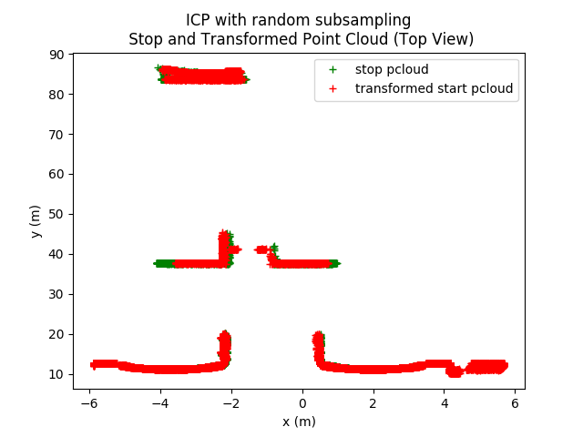
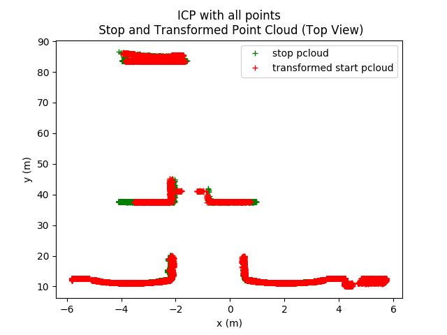
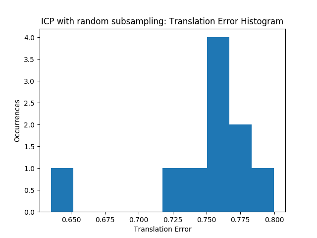
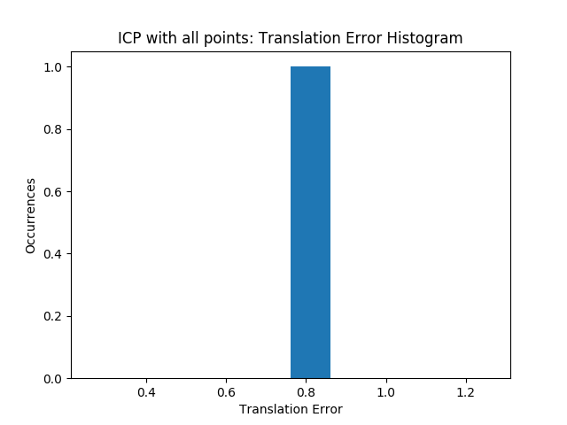

# icp_experiments
Iterative-Closest-Point algorithm tests.

All the core functions are located in icp.py.

## Performance of two ICP variants.
Below is the ouptut of icp_carla_data, which runs 2 different ICP algorithms on two point clouds collected at two points (the start and stop point) separated by exactly 10 meters (with no rotation).

The two algorithms are: regular ICP and ICP with random subsampling (which is ran multiple times as it is random in nature). The plots compare the performance of the two:
* The two first plots show the translated start point cloud superimposed onto the stop point cloud for both of these aglorithms (lowest error resutl for ICP with random subsampling is shown)
* The two last plots show a histogram the norm of the translation error across all runs.

